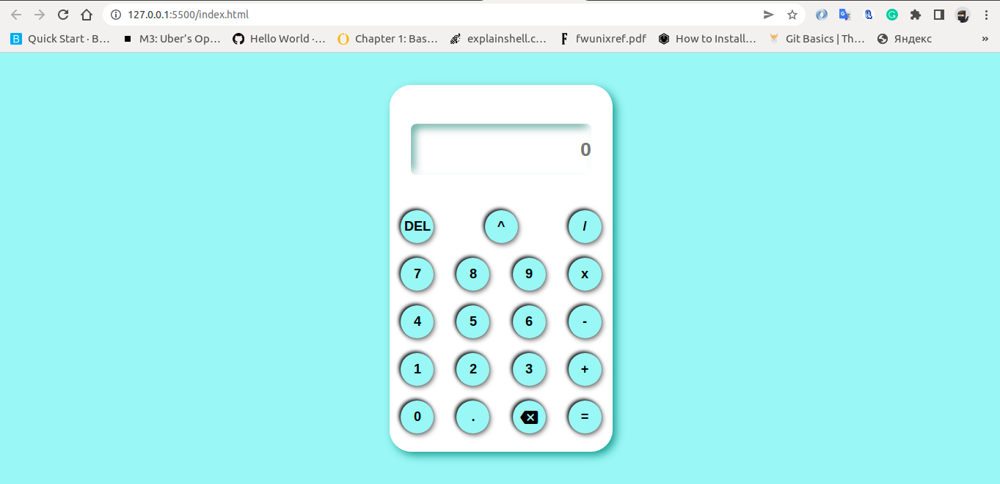

# Web3bridge Web2 Final Project
A simple calculator 

## Initial Preview



## Setup

The first thing to do is to clone the repository:

```sh
$ git clone https://github.com/izudada/calculator_project.git
```

Open the index.html with any browser of your choice.

Note: If your text editor is VsCode, you can install liverserver extension and easily run this 
        project on your browser.

## Author

- Website - [Anthony Udeagbala](https://izudada.herokuapp.com/)
- Frontend Mentor - [@izudada](https://www.frontendmentor.io/profile/izudada)
- Twitter - [@_izudada](https://twitter.com/_izudada)